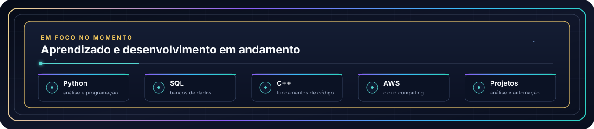

<!-- ====================== HEADER ====================== -->

  

  
  

  

<!-- ====================== SOBRE MIM ====================== -->
## Sobre mim

Sou estudante de **Bacharelado em Estatística e Ciência de Dados na Universidade Federal de Ouro Preto (UFOP)**, com interesse na interseção entre **Estatística, análise de dados, programação e Economia**.

Tenho conhecimentos em **R, Python e SQL**, utilizo **Excel em nível avançado** e possuo conhecimentos básicos em **SPSS** e **Minitab**, adquiridos ao longo da graduação. Atualmente, estou ampliando meus conhecimentos em **C++** e iniciando meus estudos em **AWS** e computação em nuvem.

Também utilizo **Quarto, Markdown e LaTeX** para documentação técnica, relatórios e análises reproduzíveis.

  

  

<!-- ====================== COMPETÊNCIAS ====================== -->
## Competências

  

<table width="100%">
<tr>
<td width="50%" valign="top">

### Dados e Estatística

<table>
<tr><td></td><td>Análise estatística, exploração e visualização de dados</td></tr>
<tr><td></td><td>Programação, análise de dados e automação</td></tr>
<tr><td></td><td>Consultas e manipulação básica de dados</td></tr>
<tr><td></td><td>Fórmulas, tabelas dinâmicas, gráficos e análise</td></tr>
<tr><td></td><td>Conhecimento básico (graduação)</td></tr>
<tr><td></td><td>Conhecimento básico (graduação)</td></tr>
</table>

</td>
<td width="50%" valign="top">

### Programação, Documentação e Cloud

<table>
<tr><td></td><td>Fundamentos de programação em desenvolvimento</td></tr>
<tr><td></td><td>Leitura e edição de código existente</td></tr>
<tr><td></td><td>Leitura e edição de estruturas existentes</td></tr>
<tr><td></td><td>Relatórios e documentação reproduzível</td></tr>
<tr><td></td><td>Documentação científica e textos técnicos</td></tr>
<tr><td></td><td>Estudos iniciais em cloud computing</td></tr>
</table>

</td>
</tr>
</table>

  

<!-- ====================== FORMAÇÃO E INTERESSES ====================== -->
## Formação e interesses

<table width="100%">
<tr>
<td width="50%" valign="top">

### Estatística e dados

- Estatística descritiva e probabilidade
- Inferência e testes estatísticos
- Correlação e regressão linear
- Computação estatística
- Visualização de dados
- Interesse em Ciência de Dados e análise quantitativa

</td>
<td width="50%" valign="top">

### Economia

- Interesse acadêmico em Economia
- Microeconomia
- Macroeconomia
- Aplicações quantitativas a dados econômicos
- Interesse em modelagem e indicadores

</td>
</tr>
</table>

  

  

<!-- ====================== EM FOCO NO MOMENTO ====================== -->
## Em foco no momento

  

  

<!-- ====================== RODAPÉ ====================== -->

  

  
  

